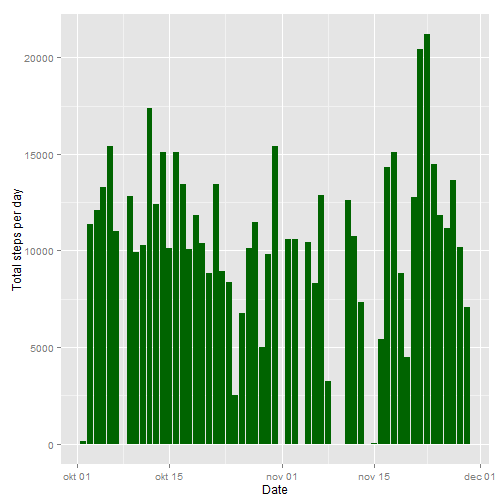
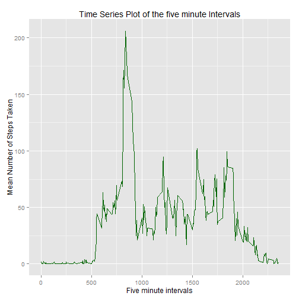
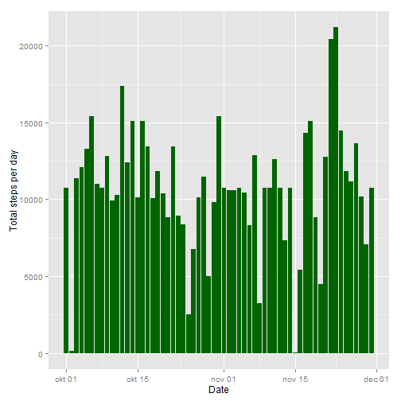

## Info

## Settings
It is given in the assignment that the code should always be visible.

```r
echo = TRUE # Code is visible by default
```
## Loading and preprocessing the data

The data is stored in a zip folder called activity.zip.

```r
unzip("activity.zip") # The data folder is unzipped
data <- read.csv("activity/activity.csv",colClasses = c("integer","Date","integer")) # Read the data and format
#attach(data) # Attach so objects can be accessed by their names
```
Lets inspect the data

```r
head(data) # 6 first lines of the data
```

```
##   steps       date interval
## 1    NA 2012-10-01        0
## 2    NA 2012-10-01        5
## 3    NA 2012-10-01       10
## 4    NA 2012-10-01       15
## 5    NA 2012-10-01       20
## 6    NA 2012-10-01       25
```

```r
str(data)  # Compactly display the internal structure of the data
```

```
## 'data.frame':	17568 obs. of  3 variables:
##  $ steps   : int  NA NA NA NA NA NA NA NA NA NA ...
##  $ date    : Date, format: "2012-10-01" "2012-10-01" ...
##  $ interval: int  0 5 10 15 20 25 30 35 40 45 ...
```
Create a dataset without NA's.

```r
data_noNA <- na.omit(data) # Remove observations with NA's
attach(data_noNA) # Attach so objects can be accessed by their names
```

```
## The following object is masked from TotalSteps_filled (pos = 5):
## 
##     date
## 
## The following object is masked from MeanStepsInterval (pos = 6):
## 
##     interval
## 
## The following objects are masked from data_noNA (pos = 8):
## 
##     date, interval, steps
## 
## The following object is masked from TotalSteps_filled (pos = 10):
## 
##     date
## 
## The following object is masked from MeanStepsInterval (pos = 11):
## 
##     interval
## 
## The following objects are masked from data_noNA (pos = 13):
## 
##     date, interval, steps
## 
## The following object is masked from MeanStepsInterval (pos = 14):
## 
##     interval
## 
## The following objects are masked from data_noNA (pos = 16):
## 
##     date, interval, steps
## 
## The following object is masked from MeanStepsInterval (pos = 17):
## 
##     interval
## 
## The following objects are masked from data_noNA (pos = 19):
## 
##     date, interval, steps
## 
## The following objects are masked from data (pos = 23):
## 
##     date, interval, steps
## 
## The following objects are masked from data (pos = 24):
## 
##     date, interval, steps
```

## What is mean total number of steps taken per day?
For this part the missing values are ignored

### Calculate the total number of steps taken per day
Get the "dplyr" package to compactly do calculations.

```r
library(dplyr)
```
Calculate the total number of steps taken per day

```r
data_noNA <- data.frame(data_noNA) # Convert to a data frame
StepsPerDay <- data_noNA[,1:2] %>% group_by(date) %>% summarise(sum(steps))
names(StepsPerDay)<-c("dateGroup","TotalSteps")
attach(StepsPerDay) # Attach so objects can be accessed by their names
```

```
## The following objects are masked from StepsPerDay (pos = 8):
## 
##     dateGroup, TotalSteps
## 
## The following objects are masked from StepsPerDay (pos = 10):
## 
##     dateGroup, TotalSteps
## 
## The following objects are masked from StepsPerDay (pos = 13):
## 
##     dateGroup, TotalSteps
## 
## The following objects are masked from StepsPerDay (pos = 16):
## 
##     dateGroup, TotalSteps
## 
## The following objects are masked from StepsPerDay (pos = 21):
## 
##     dateGroup, TotalSteps
```

```r
head(StepsPerDay)
```

```
## Source: local data frame [6 x 2]
## 
##    dateGroup TotalSteps
## 1 2012-10-02        126
## 2 2012-10-03      11352
## 3 2012-10-04      12116
## 4 2012-10-05      13294
## 5 2012-10-06      15420
## 6 2012-10-07      11015
```
###  Make a histogram of the total number of steps taken each day
Use the ggplot2 package to make the histogram

```r
library(ggplot2)
```

```r
ggplot(data_noNA ,aes(date,steps))+geom_histogram(stat = "identity",fill="darkgreen")+labs(x="Date",y="Total steps per day")
```

 

### Calculate and report the mean and median of the total number of steps taken per day

```r
round(mean(TotalSteps))  # The mean number of whole steps
```

```
## [1] 10766
```

```r
median(TotalSteps)       # The median number of steps
```

```
## [1] 10765
```

## What is the average daily activity pattern?

### Make a time series plot (i.e. type = "l") of the 5-minute interval (x-axis) and the average number of steps taken, averaged across all days (y-axis)

```r
MeanStepsInterval <- data_noNA[,c(1,3)] %>% group_by(interval) %>% summarise(mean(steps))
names(MeanStepsInterval)[2] <-  "MeanSteps"
ggplot(MeanStepsInterval,aes(interval,MeanSteps)) + geom_line(color = "darkgreen") + labs(title = "Time Series Plot of the five minute Intervals", x = "Five minute intervals", y = "Mean Number of Steps Taken")
```

 


### Which 5-minute interval, on average across all the days in the dataset, contains the maximum number of steps?

```r
attach(MeanStepsInterval)
```

```
## The following object is masked from data_noNA (pos = 4):
## 
##     interval
## 
## The following objects are masked from MeanStepsInterval (pos = 8):
## 
##     interval, MeanSteps
## 
## The following object is masked from data_noNA (pos = 10):
## 
##     interval
## 
## The following objects are masked from MeanStepsInterval (pos = 13):
## 
##     interval, MeanSteps
## 
## The following object is masked from data_noNA (pos = 15):
## 
##     interval
## 
## The following objects are masked from MeanStepsInterval (pos = 16):
## 
##     interval, MeanSteps
## 
## The following object is masked from data_noNA (pos = 18):
## 
##     interval
## 
## The following objects are masked from MeanStepsInterval (pos = 19):
## 
##     interval, MeanSteps
## 
## The following object is masked from MeanStepsInterval (pos = 20):
## 
##     MeanSteps
## 
## The following object is masked from data_noNA (pos = 21):
## 
##     interval
## 
## The following object is masked from data (pos = 25):
## 
##     interval
## 
## The following object is masked from data (pos = 26):
## 
##     interval
```

```r
interval[MeanSteps==max(MeanSteps)] # Interval with highst mean number of steps
```

```
## [1] 835
```

## Imputing missing values

### Calculate and report the total number of missing values in the dataset (i.e. the total number of rows with NAs)
NA's were only observed in the interval column, hence the total number of rows with NAs

```r
sum(is.na(data))
```

```
## [1] 2304
```
### Devise a strategy for filling in all of the missing values in the dataset
As we have already calculated the mean for each interval I will use the rounded number of steps to fill the missing values as non-integer steps.


### Create a new dataset that is equal to the original dataset but with the missing data filled in.

```r
data_filled <- merge(data,MeanStepsInterval,by.x="interval",by.y="interval")
data_filled$steps[is.na(data_filled$steps)]=round(data_filled$MeanSteps[is.na(data_filled$steps)])
data_filled <- data_filled[,1:3]
head(data_filled)
```

```
##   interval steps       date
## 1        0     2 2012-10-01
## 2        0     0 2012-11-23
## 3        0     0 2012-10-28
## 4        0     0 2012-11-06
## 5        0     0 2012-11-24
## 6        0     0 2012-11-15
```

### Make a histogram of the total number of steps taken each day and Calculate and report the mean and median total number of steps taken per day. Do these values differ from the estimates from the first part of the assignment? What is the impact of imputing missing data on the estimates of the total daily number of steps?

```r
ggplot(data_filled ,aes(date,steps))+geom_histogram(stat = "identity",fill="darkgreen")+labs(x="Date",y="Total steps per day")
```

 

```r
TotalSteps_filled <- data_filled %>% group_by(date) %>% summarise(sum(steps))
names(TotalSteps_filled)[2] <- "TotalSteps_All"
attach(TotalSteps_filled)
```

```
## The following object is masked from data_noNA (pos = 5):
## 
##     date
## 
## The following objects are masked from TotalSteps_filled (pos = 8):
## 
##     date, TotalSteps_All
## 
## The following object is masked from data_noNA (pos = 11):
## 
##     date
## 
## The following objects are masked from TotalSteps_filled (pos = 13):
## 
##     date, TotalSteps_All
## 
## The following object is masked from data_noNA (pos = 16):
## 
##     date
## 
## The following object is masked from data_noNA (pos = 19):
## 
##     date
## 
## The following object is masked from data_noNA (pos = 22):
## 
##     date
## 
## The following object is masked from data (pos = 26):
## 
##     date
## 
## The following object is masked from data (pos = 27):
## 
##     date
```

```r
round(mean(TotalSteps_All))
```

```
## [1] 10766
```

```r
median(TotalSteps_All)
```

```
## [1] 10762
```
Lets compare the with the ones without imputeting the missing data

```r
round(mean(TotalSteps_All)) - round(mean(TotalSteps))  
```

```
## [1] 0
```

```r
median(TotalSteps_All) - median(TotalSteps) 
```

```
## [1] -3
```


## Are there differences in activity patterns between weekdays and weekends?
The dataset with the filled-in missing values is used for this part

### Create a new factor variable in the dataset with two levels - "weekday" and "weekend" indicating whether a given date is a weekday or weekend day.
Get the numeric representation of the days as my locale settings are not english. (Beware: Your locale settings might not represent Sunday as day number 0).

```r
data_filled$day<- as.POSIXlt(data_filled$date)$wday #
data_filled$day[data_filled$day== 1 ]="weekday"
data_filled$day[data_filled$day== 2 ]="weekday"
data_filled$day[data_filled$day== 3 ]="weekday"
data_filled$day[data_filled$day== 4 ]="weekday"
data_filled$day[data_filled$day== 5 ]="weekday"
data_filled$day[data_filled$day== 6 ]="weekend"
data_filled$day[data_filled$day== 0 ]="weekend"
data_filled$day <- factor(data_filled$day)
head(data_filled)
```

```
##   interval steps       date     day
## 1        0     2 2012-10-01 weekday
## 2        0     0 2012-11-23 weekday
## 3        0     0 2012-10-28 weekend
## 4        0     0 2012-11-06 weekday
## 5        0     0 2012-11-24 weekend
## 6        0     0 2012-11-15 weekday
```

```r
table(data_filled$day)
```

```
## 
## weekday weekend 
##   12960    4608
```

### Make a panel plot containing a time series plot (i.e. type = "l") of the 5-minute interval (x-axis) and the average number of steps taken, averaged across all weekday days or weekend days (y-axis). See the README file in the GitHub repository to see an example of what this plot should look like using simulated data.

The example in the README file looks like it has been created with the xyplot command.
Include the lattice pacakge.

```r
library(lattice)
```

Makes the panel plot


```r
MeanStepsInterval <- data_filled[,c(1,2,4)] %>% group_by(interval,day) %>% summarise(mean(steps))
names(MeanStepsInterval)[3] <-  "MeanSteps"
xyplot(MeanStepsInterval$MeanSteps ~ MeanStepsInterval$interval | MeanStepsInterval$day, 
       layout = c(1, 2), type = "l", xlab = "Interval", ylab = "Number of steps")
```

 


